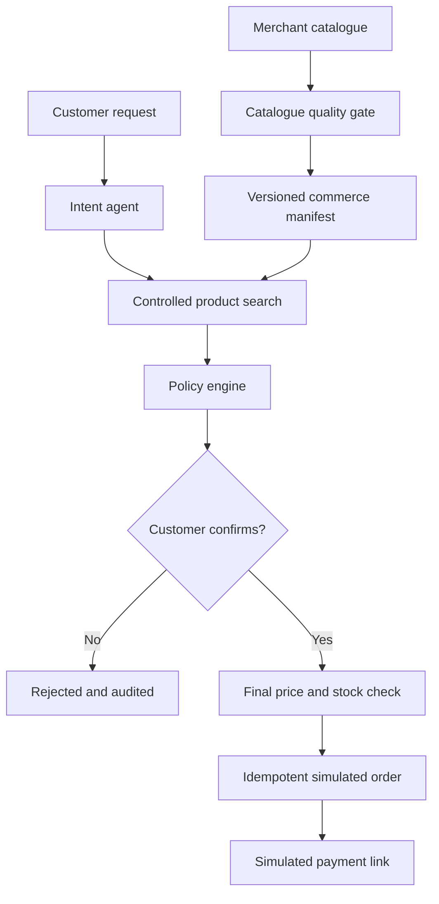

# AgentReady

**Merchant Trust and Transaction Gateway for Agentic Commerce**

AgentReady is a working portfolio prototype for the Razorpay AI Builder Internship 2026, Track 1: AI Growth & Agentic Commerce. It converts a merchant catalogue into a governed commerce manifest, grounds natural-language shopping requests in approved product records, enforces deterministic transaction policies, requires customer confirmation, and creates an idempotent simulated payment link.

> **Truthful scope:** every merchant, product, customer, order and outcome in this repository is synthetic. The Razorpay adapter is simulated. This is not an official Razorpay product, does not use confidential Razorpay data, and never moves money.

## Why this project exists

Agentic payments solve only the last step of a longer commerce decision. Before any payment request is safe, a merchant must prove that the product exists, the requested variant is available, the price is current, the customer is eligible, the delivery promise is valid, and required approvals have been collected.

Small and medium-sized merchants often keep this information in spreadsheets, PDFs and disconnected inventory tools. An unrestricted shopping agent could therefore invent a product attribute, quote stale pricing, apply an invalid offer, promise an unsupported delivery, or create the same order more than once.

AgentReady is the merchant-side control plane for that gap.

## What the demo proves

- Catalogue-quality analysis catches invalid prices, negative stock, duplicate SKUs, missing policy fields and unsafe offers.
- A versioned commerce manifest includes only products that pass the quality gate.
- Natural-language requests are converted into structured intent.
- Product recommendations are retrieved from the approved catalogue, not generated from model memory.
- Money, inventory, delivery and offer decisions are handled by deterministic code.
- A stateful workflow cannot jump over the confirmation gate.
- Duplicate execution is prevented with an idempotency key.
- The payment adapter returns a clearly fake `example.invalid` link and never moves money.
- Every transition is recorded in an audit timeline.

## One-minute demo path

1. Open the dashboard and review the AI-commerce readiness score.
2. Open **Catalogue readiness** to inspect planted data-quality and prompt-injection failures.
3. Open **AI purchase simulator**.
4. Run: `Find me black running shoes in size 9 under ₹3,000 for delivery to Bengaluru`.
5. Select the grounded catalogue result.
6. Review the deterministic subtotal, discount, delivery fee and total.
7. Confirm the simulated order.
8. Create the simulated payment link.
9. Open **Audit and safety** to inspect the complete event trail.
10. Try: `Red running shoes size 12 below ₹500 in Delhi`. The agent refuses instead of inventing a product.

## Architecture



The architecture intentionally keeps the probabilistic and deterministic layers separate.

### Probabilistic layer

- Understands natural-language shopping intent.
- Suggests catalogue corrections.
- Explains recommendations.
- Returns structured data rather than transactional commands.

### Deterministic layer

- Searches authoritative product records.
- Validates price, stock, delivery, offer and quantity.
- Calculates all monetary values.
- Enforces state transitions and confirmation.
- Generates idempotency keys.
- Records immutable-style audit events.

## Technology

- Python 3.12
- FastAPI and Pydantic for the web API
- Provider interface with deterministic demo mode and optional OpenAI Structured Outputs
- Plain HTML, CSS and JavaScript for a zero-build, reliable demonstration frontend
- Python `unittest` for dependency-free core testing
- Docker and Docker Compose
- GitHub Actions CI

The frontend deliberately avoids a large JavaScript dependency tree. The internship demo should boot reliably on a clean machine and remain understandable during an interview.

## Run locally

### Standard Python setup

```bash
python -m venv .venv
source .venv/bin/activate
pip install -r requirements.txt
cp .env.example .env
uvicorn backend.app.main:app --reload
```

Open `http://localhost:8000`.

API documentation is available at `http://localhost:8000/docs`.

### Docker

```bash
cp .env.example .env
docker compose up --build
```

Open `http://localhost:8000`.

## AI modes

### Deterministic mode

The default configuration uses a reproducible intent parser. It requires no API key and keeps the public demo stable.

```env
AI_PROVIDER=deterministic
```

### Optional OpenAI mode

OpenAI mode uses the Responses API with Structured Outputs to extract only explicit shopping constraints. Structured output does not authorize the model to execute commerce actions.

```env
AI_PROVIDER=openai
OPENAI_API_KEY=your_key
OPENAI_MODEL=gpt-5.6-luna
```

The repository does not contain or commit an API key.

## API endpoints

- `GET /api/health` returns service status and synthetic-data disclosure.
- `GET /api/catalogue/analysis` returns readiness metrics and catalogue issues.
- `GET /api/catalogue/manifest` returns the governed merchant commerce manifest.
- `GET /api/products` returns the synthetic source catalogue.
- `POST /api/commerce/search` creates a controlled commerce session.
- `POST /api/commerce/{session_id}/select` validates a selected grounded product.
- `POST /api/commerce/{session_id}/confirm` records explicit customer confirmation.
- `POST /api/commerce/{session_id}/execute` runs final validation and creates a simulated link.
- `GET /api/commerce/{session_id}` returns the current state and audit trail.

## Synthetic data

Generate a reproducible 500-product catalogue with known anomalies:

```bash
python scripts/generate_data.py
```

The generator uses a fixed seed and deliberately plants:

- An invalid negative price
- Negative inventory
- A duplicate SKU
- Missing delivery coverage
- A prompt-injection string inside a product description

These anomalies exist to evaluate blocking behaviour, not to inflate performance claims.

## Tests

The core suite runs without FastAPI or a model key:

```bash
python -m unittest discover -s tests -v
```

The suite verifies:

- Catalogue-quality failures are detected.
- Blocked products are excluded from the commerce manifest.
- Search results are grounded in catalogue records.
- Invalid prices cannot enter search results.
- Missing preferences are not invented.
- Delivery and offer policies are enforced.
- Out-of-catalogue selection is rejected.
- Execution without confirmation fails.
- Impossible requests are refused.
- Repeated execution returns the existing order result.

## Evaluation framework

The most important evaluation measures are safety and correctness, not response fluency.

- Catalogue issue-detection accuracy
- Structured intent extraction accuracy
- Product retrieval precision
- Unsupported product rate
- Price-validation success rate
- Policy-violation blocking rate
- Duplicate-action rate
- Confirmation bypass incidents
- Workflow completion rate
- Median API latency

The safety targets for this prototype are zero invented prices reaching execution, zero orders without confirmation, and zero duplicate simulated links for the same idempotency key.

## Repository structure

```text
backend/app/          FastAPI adapter, domain models and business services
frontend/             Zero-build merchant dashboard
scripts/              Reproducible synthetic-data generation
tests/                Unit and adversarial workflow tests
data/                 Generated synthetic catalogue
docs/                 Architecture, safety, demo and pitch documentation
.github/workflows/    Continuous integration
```

## Security and limitations

- AgentReady never stores card numbers, CVVs, UPI PINs or bank credentials.
- The LLM never calculates or approves a transaction total.
- Uploaded catalogue text must be treated as untrusted input.
- The simulated adapter does not represent a production Razorpay integration.
- The in-memory demo store is not suitable for production.
- Real deployment would require authentication, merchant tenancy, database transactions, stock reservation, webhook signature verification, rate limiting, encryption, observability and formal security review.
- Synthetic evaluation cannot establish real merchant conversion improvement.

Read [Safety and Threat Model](docs/safety.md) for the full boundary analysis.

## Interview defence

If asked why the project is agentic, the defensible answer is that it maintains transaction state, selects bounded tools, pauses for human approval, revalidates changing facts, handles failure states and records actions. The LLM itself is not the agent and is not trusted with execution authority.

If asked why the system does not use a vector database, the answer is that product constraints such as size, price, inventory and delivery are structured filters. SQL-style retrieval is more accurate, cheaper and easier to audit.

If asked why the demo includes a deterministic mode, the answer is reliability and reproducibility. An evaluator should be able to run the complete safety workflow without an external account or paid API.

## Author

**Navedhya Goyal**  
PGDM student, Jagdish Sheth School of Management (JAGSoM)  
Interests: AI, product management, business analytics, FinTech and automation

## License

MIT License. See [LICENSE](LICENSE).

